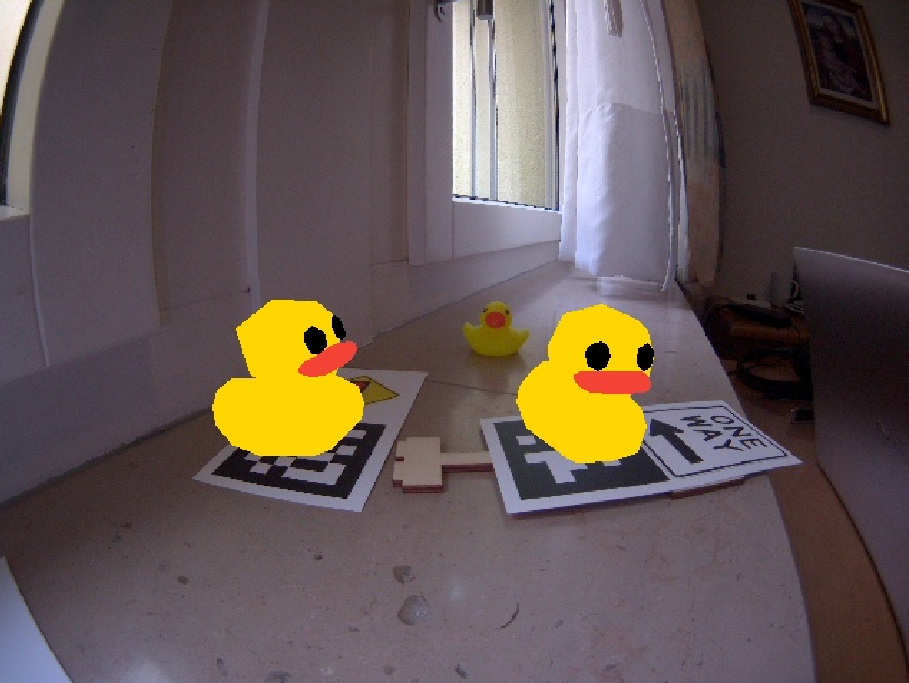

# Advanced Augmented Reality Exercise {#cra-apriltag-augmented-reality-exercise status=ready}

Excerpt: Apply your competences in software development in a perception pipeline.

The goal of this exercise is to put your skills in computer graphic to the test by projecting a complex 3D model on an AprilTag at an arbitrary position.

<div class='requirements' markdown='1'>
  Requires: [Camera calibration](+opmanual_duckiebot#camera-calib)

  Requires: [Docker basics](+duckietown-robotics-development#docker-basics)

  Requires: [ROS basics](+duckietown-robotics-development#sw-advanced)

  Requires: [Knowledge of the software architecture on a Duckiebot](+duckietown-robotics-development#duckietown-code-structure)
  
  Requires: [Basic Augmented Reality Exercise](#cra-basic-augmented-reality-exercise)

  Results: Advanced skills on how to manipulate transformations in Computer Graphics.

  Results: Insights into the computer graphics pipeline.
</div>

## 3D Model Projection Exercise {#cra-apriltag-augmented-reality-exercise-introduction}

In this exercise you are asked to render a complete 3D model of a duckie on an image. The duckie model is provided as an `.obj` file. Similarly to many augmented reality games the model needs to be projected on an easily recognizable flat pattern. In this exercise you will use an [AprilTag](https://april.eecs.umich.edu/software/apriltag) for this purpose.
You should have received some traffic signs with AprilTags with the your Duckiebot box. They should look something like:  
<figure>
  
</figure>

In Duckietown, AprilTags are recognized and managed through the [lib-dt-apriltags](https://github.com/duckietown/lib-dt-apriltags) Python package. Check it out to see how to use it! 
 
In order to solve the exercise you will have to create a package called `augmented_reality_apriltag` with the functionalities specified in [](#cra-basic-augmented-reality-exercise).

## Instructions {#cra-apriltag-augmented-reality-exercise-instructions}

1. This exercise package structure will be based on the one provided by the [AprilTag Template](https://github.com/duckietown-ethz/cra1-template). Inside there you will find everything you need like the 3D model and the provided files.


2. In this exercise you will have to use the AprilTag library so check that it has been added in the `dependencies-py3.txt` as `dt-apriltags`.
3. We provided you a file called `renderClass.py`. Inside you will find the `Renderer` class which allows you to draw a 3D `.obj` model onto an image. If you are curious about how this happens, the code inside this file is a modified version of [Pygame OBJFileLoader](http://www.pygame.org/wiki/OBJFileLoader).
  The provided Renderer class contains the method `render(img, projection_matrix)`, where `img` is the image you want to project the model onto and `projection_matrix` is the 3x4 matrix that transforms the 3D model coordinates to the AprilTag reference system allowing you to project it.
  The constructor of an instance of the `Renderer` class requires the 3D model as input. Keep the 3D model in a directory with the path `src/models`. You can use the code below to correctly initialize an instance of the `Renderer` class:
      ```Python
      # Import class from file.
      from renderClass import Renderer
    
      rospack = rospkg.RosPack()
    
      # Initialize an instance of Renderer giving the model in input.
      self.renderer = Renderer(rospack.get_path('YOUR PACKAGE NAME')+'/src/models/duckie.obj')
      ```
      Please refrain from changing the `renderClass.py` file. It has been tested and any change might lead to unexpected errors and problems that will not be supported. 
3. You will also get a function to load the calibration parameters of your Duckiebot camera which should be in the node python file. 
4. Conversely to the previous exercise, here you are not asked to rectify the image to reduce the delay of this node. You are nonetheless invited to try this yourself and see how accuracy and speed are affected. 

## Exercise Structure {#cra-apriltag-augmented-reality-exercise-structure}

Looking at the project as a whole may make it seem more difficult than it really is. But we will follow the latin proverb _divide et impera_ (_divide and rule_). In other words, we will brake down the big monolithic problem into a few smaller and manageable tasks.

First, let's focus on what we are trying to achieve: to project a 3D model onto an image such that the position and orientation of the model match the position and orientation of an AprilTag. The break-down of this task looks like that:
1. Detect the AprilTag and extract its reference frame.
2. Estimate the homography matrix: determine the transformation from the reference frame of the AprilTag (2D) to the reference frame of the target image (2D). This transformation is the homography matrix. For this step and the previous one, have a look at the [lib-dt-apriltags](https://github.com/duckietown/lib-dt-apriltags) repository, you will find it quite useful.
3. Derive the transformation from the reference frame of the AprilTag to the target image reference frame: if we want to project a 3D model placed on top of the reference surface to the target image, we need to extend the previous transformation to handle cases were the height of the point to project is different from zero. This can be achieved with some knowledge about coordinate system transformations and a bit of algebra. To know more about homography and orthonormal basis give a look [here](https://docs.opencv.org/master/d9/dab/tutorial_homography.html).
4. Project our 3D model in the image (pixel space) and draw it: you can use the provided `Renderer` class for this. This class has a method called `render` which gets an input `img` of type [InputOutputArray](https://docs.opencv.org/master/dc/d84/group__core__basic.html#gaf77c9a14ef956c50c1efd4547f444e63) and `projection_matrix` (3x4 floating-point matrix). The `render` method colors the polygons formed by the vertices of the `.obj` file.

The expected outcome of this exercise should something like this:

<figure>
  
</figure>

## Parameter Tweaking {#cra-apriltag-augmented-reality-exercise-parameters}

As you might have seen the AprilTag detection adds some delay to the pipeline. However, you can try to change some parameters for a better accuracy and speed trade-off. Try to play around with the parameters `nthreads` and `quad_decimate` of the `dt_apriltags.Detector` class. What do they change? Does the speed improve? What about the stability and accuracy of the detector?
